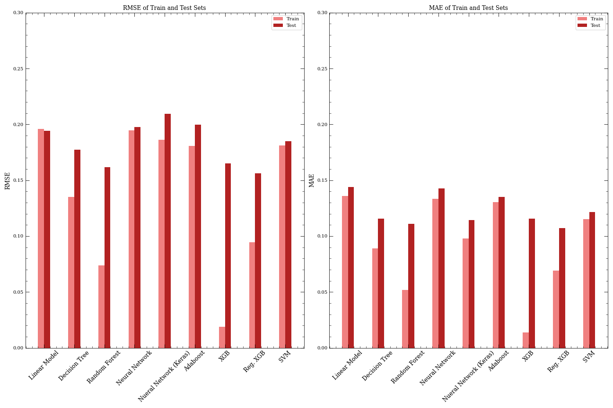

# DengAI_final

This code presents a sophisticated regressor model designed to predict the incidence of Dengue fever, a serious viral disease that is primarily transmitted by mosquitoes. The model has been trained using a dataset that was collected from two distinct locations: San Juan, Puerto Rico, and Iquitos, Peru. With this dataset, our model is capable of accurately predicting Dengue fever outbreaks in these areas, providing valuable insights that can help inform public health interventions and guide disease prevention efforts.

The steps taken for getting the model were the following. 

1. Download the data at: "https://www.drivendata.org/competitions/44/dengai-predicting-disease-spread/".

2. Read over the problem and discuss the features within the group. 

3. Separate the train/test data into different files for each city.

4. Do an Exploratory Data Analysis, understanding all the data, and choosing which features would make the best impact within the model:
  - Temperature from reanalysis were droped as they are simulated and there are observed data from station;
  - Precipitation from reanalysis were droped for the same reason, and as satelites contains many assumptions, were also dropped. We kept the data from station;
  - Relative Humidity and specific Humidity were kept;
  - All NDVIs were kept. While San Juan presents a mix of ocean and bare soil, Iquitos has more of a sparse vegetation.

5. Fill missing values with the average from the above and below dataframe cells. 

6. Calculate and apply thresholds for quantiles of 97.5% in cases of outliers.

7. Transform values of the features for values close to 0.

8. Select the target feature and divide the data into train and test. 

9. Perform different regressor models in order to make a comparison between then: 
 - Linear Model;
 - Decision Tree;
 - Random Forest;
 - Neural Network;
 - Neural Network from Keras;
 - Adaboost;
 - eXtreme Gradient Boosting (XGB);
 - Regularized XGB;
 - Support Vector Machine.

10. Compare all results of the models and choose which one to use for submission.
 RMSE and MAE for San Juan:

11. Run the model chosen with all the train data (not splitting Train/Test).

12. Run the test data with the output of the model.

13. Submit to drivendata.

